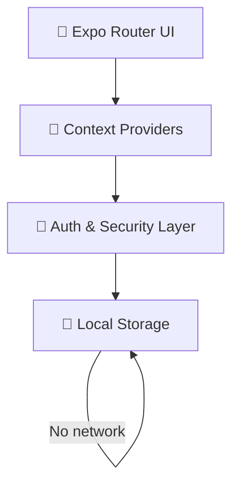
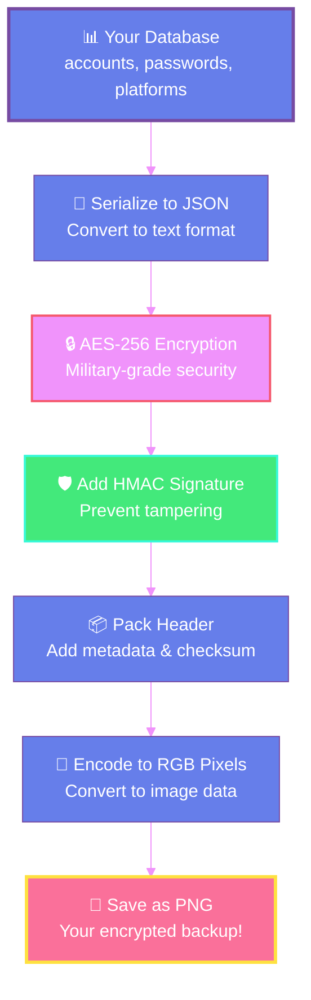
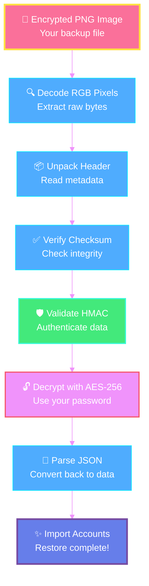
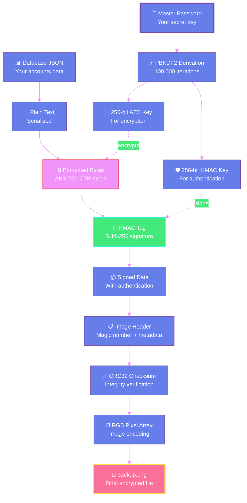

<div align="center">


<h1> Passify </h1>

<h4> A Privacy-First, Offline Password Manager </h4>

<p align="center">
  
  
  
  
</p>
</div>

---

## 🎯 About The Project

**The Problem:** Managing passwords across multiple platforms is challenging. Traditional password managers require cloud sync, raising privacy concerns. Users need a secure, offline-first solution that puts them in complete control.

**The Solution:** Passify is a modern, cross-platform password manager that stores and protects your credentials locally using strong cryptographic primitives. Your data never leaves your device, and you can export everything as a visually encoded image backup.

### ✨ Key Highlights

<table align='center'>
<tr>
<td align="center">

<br><b>Military-Grade Encryption</b><br>AES-256 with PBKDF2
</td>
<td align="center">

<br><b>Image-Based Backups</b><br>Convert to encrypted PNG
</td>
<td align="center">

<br><b>100% Offline</b><br>No cloud sync
</td>
</tr>
<tr>
<td align="center">

<br><b>Smart Search & Sort</b><br>Find anything instantly
</td>
<td align="center">

<br><b>Highly Customizable</b><br>11 themes, 10+ fonts
</td>
<td align="center">

<br><b>Fast & Smooth</b><br>Optimized performance
</td>
</tr>
</table>

---

##  Features

### 🗂️ Password Management

- Organize by platform (Gmail, GitHub, Instagram, etc.)
- Custom field schemas per platform
- Batch operations & multi-select
- Visual platform icons with custom colors

### 🔍 Search & Organization

- Real-time search with suggestions
- Multiple sorting options (recent, alphabetical, date)
- Smart filtering & highlighted matches

### 🔐 Encryption & Security

- AES-based symmetric encryption
- Password-derived keys using PBKDF2
- HMAC-based integrity verification
- Checksum validation for corruption detection

### 📸 Encoder & 🔓 Decoder

- Convert database to encrypted PNG
- Visual progress tracking
- Share/download backups
- Password-protected restoration
- Preview before importing

### 🔄 Import & Export

- Import from text files or clipboard
- Export to formatted text
- Bulk import with auto-detection

### 🔑 Authentication

- Biometric (Face ID, Touch ID, Fingerprint)
- PIN code protection
- Auto-lock (1, 5, 10, 30 min, or never)
- App background blur

### 🎨 Customization

- **11 Themes** (Sunrise, Ocean, Forest, Rose Gold, OLED Dark, etc.)
- **10+ Fonts** (Inter, Lexend, Poppins, Roboto Mono, JetBrains Mono, etc.)
- **Screen Transitions** (Slide, Fade, Scale, Flip)

### 🎓 User Experience

- Interactive 6-slide onboarding
- Smooth Moti & Reanimated animations
- Pull-to-refresh everywhere
- Toast notifications

---

## 📱 App Screenshots

<details>
<summary><b>🗂️ Platform & Account Management</b></summary>

<p align="center">
  
  
</p>

<p align="center">
  <i>Platform overview and individual account management screens</i>
</p>

</details>

<details>
<summary><b>🔐 Encoder & Decoder</b></summary>

<p align="center">
  
  
</p>

<p align="center">
  <i>Encrypted image backup creation and restoration flow</i>
</p>

</details>

<details>
<summary><b>🎨 Customization</b></summary>

<p align="center">
  
  
  
  
</p>

<p align="center">
  <i>Theme, font, animation style, and security customization screens</i>
</p>

</details>

---

## 🛠️ Tech Stack

<div align="center">


<br><br>

**Additional Technologies:**
Expo - Moti - Reanimated - AES-JS - AsyncStorage - Ionicons

</div>

<details>
<summary><b>📦 View All Dependencies</b></summary>

**Core Technologies**

- React Native, Expo, TypeScript

**Navigation & Routing**

- Expo Router (file-based routing)

**Animation Libraries**

- Moti, React Native Reanimated, Gesture Handler

**Security & Storage**

- AES-JS, Expo Secure Store, Expo Local Authentication, AsyncStorage

**UI Components**

- Expo Linear Gradient, Ionicons, 10+ Google Fonts

**File & Media**

- Expo Document Picker, File System, Sharing, Clipboard

</details>

---

## 🧠 High-Level Architecture



> Passify operates entirely offline. All data flows remain within the device.

---

## 📁 Folder Structure

```mermaid
graph TB
    A[📦 Passify Root]

    A --> B[📱 app/]
    A --> C[🔧 src/]
    A --> D[🎨 assets/]
    A --> E[⚙️ Config Files]

    B --> B1[📂 tabs/]
    B --> B2[📂 onboarding/]
    B --> B3[📂 screens/]
    B --> B4[_layout.tsx]
    B --> B5[index.tsx]
    B --> B6[onboarding.tsx]

    B1 --> B1A[index.tsx]
    B1 --> B1B[accounts.tsx]
    B1 --> B1C[transfer.tsx]
    B1 --> B1D[encoder.tsx]
    B1 --> B1E[decoder.tsx]
    B1 --> B1F[settings.tsx]

    B2 --> B2A[Slide1Welcome]
    B2 --> B2B[Slide2Tabs]
    B2 --> B2C[Slide3Security]
    B2 --> B2D[Slide4Manage]
    B2 --> B2E[Slide5Tips]
    B2 --> B2F[Slide6Start]

    B3 --> B3A[BiometricUnlock]

    C --> C1[🧩 components/]
    C --> C2[🌐 context/]
    C --> C3[🔧 utils/]
    C --> C4[📝 types/]

    C1 --> C1A[FormModal]
    C1 --> C1B[Toast]
    C1 --> C1C[ProgressBar]
    C1 --> C1D[SearchBar]
    C1 --> C1E[+15 more]

    C2 --> C2A[ThemeContext]
    C2 --> C2B[DbContext]
    C2 --> C2C[AuthContext]
    C2 --> C2D[AnimationContext]

    C3 --> C3A[crypto.ts]
    C3 --> C3B[image.ts]
    C3 --> C3C[biometricAuth.ts]
    C3 --> C3D[+12 more files]

    C4 --> C4A[aes-js.d.ts]
    C4 --> C4B[progress.ts]

    D --> D1[images/]
    D --> D2[database.json]

    D1 --> D1A[icon.png]
    D1 --> D1B[splash-icon.png]
    D1 --> D1C[favicon.png]
    D1 --> D1D[android-icons]

    E --> E1[app.json]
    E --> E2[package.json]
    E --> E3[tsconfig.json]
    E --> E4[eas.json]
    E --> E5[.eslintrc.js]

    style A fill:#667eea,stroke:#764ba2,stroke-width:4px,color:#fff
    style B fill:#f093fb,stroke:#f5576c,stroke-width:2px
    style C fill:#4facfe,stroke:#00f2fe,stroke-width:2px
    style D fill:#43e97b,stroke:#38f9d7,stroke-width:2px
    style E fill:#fa709a,stroke:#fee140,stroke-width:2px

    style B1 fill:#c471f5,stroke:#fa71cd,stroke-width:1px
    style C1 fill:#69c0ff,stroke:#40a9ff,stroke-width:1px
    style C2 fill:#95de64,stroke:#73d13d,stroke-width:1px
    style C3 fill:#ffd666,stroke:#ffc53d,stroke-width:1px
```



<details>
<summary><b>🗂️ Detailed File Tree</b></summary>

```
Passify/
├── 📱 app/                              # Expo Router app directory
│   ├── _layout.tsx                     # Root layout with providers
│   ├── index.tsx                       # App entry redirect
│   ├── +not-found.tsx                  # 404 error screen
│   ├── onboarding.tsx                  # Onboarding flow entry
│   │
│   ├── 🎓 (onboarding)/                # Onboarding slides
│   │   ├── Slide1Welcome.tsx          # Welcome & introduction
│   │   ├── Slide2Tabs.tsx             # App structure overview
│   │   ├── Slide3SecurityTools.tsx    # Encoder/Decoder explanation
│   │   ├── Slide4ManageAccounts.tsx   # Account management tutorial
│   │   ├── Slide5Tips.tsx             # Customization tips
│   │   └── Slide6GetStarted.tsx       # Final call-to-action
│   │
│   ├── 🔒 (screens)/                   # Full-screen modals
│   │   ├── BiometricUnlockScreen.tsx  # Auth unlock screen
│   │   └── _layout.tsx                # Modal layout config
│   │
│   └── 📱 (tabs)/                      # Main app tabs
│       ├── _layout.tsx                 # Tab navigator
│       ├── index.tsx                   # Manage tab (platforms)
│       ├── accounts.tsx                # Individual platform accounts
│       ├── transfer.tsx                # Import/Export hub
│       ├── encoder.tsx                 # Data-to-image encryption
│       ├── decoder.tsx                 # Image-to-data decryption
│       └── settings.tsx               # Settings & customization
│
├── 🔧 src/                              # Source code
│   ├── 🧩 components/                  # Reusable UI components (20 files)
│   │   ├── AccountSortModal.tsx
│   │   ├── BiometricPrompt.tsx
│   │   ├── ConfirmModal.tsx
│   │   ├── DecodedDataDisplay.tsx
│   │   ├── DeleteModal.tsx
│   │   ├── FAB.tsx
│   │   ├── FormModal.tsx
│   │   ├── OnboardingSlide.tsx
│   │   ├── PINInputModal.tsx
│   │   ├── PlatformIcon.tsx
│   │   ├── ProgressBar.tsx
│   │   ├── SchemaModal.tsx
│   │   ├── SearchBar.tsx
│   │   ├── SortModal.tsx
│   │   ├── ThemeSelector.tsx
│   │   ├── Toast.tsx
│   │   └── (transfer)/
│   │       ├── ImportTab.tsx
│   │       └── ExportTab.tsx
│   │
│   ├── 🌐 context/                     # React Context providers
│   │   ├── AnimationContext.tsx       # Animation preferences
│   │   ├── AuthContext.tsx            # Authentication state
│   │   ├── DbContext.tsx              # Database state management
│   │   └── ThemeContext.tsx           # Theme state & switching
│   │
│   ├── 📝 types/                       # TypeScript type definitions
│   │   ├── aes-js.d.ts               # AES-JS type declarations
│   │   └── progress.ts                # Progress tracking types
│   │
│   └── 🔧 utils/                       # Utility functions (15 files)
│       ├── biometricAuth.ts
│       ├── blocks.ts
│       ├── crypto.ts
│       ├── fileSharing.ts
│       ├── iconLibrary.ts
│       ├── image.ts
│       ├── inactivityTracker.ts
│       ├── onboardingState.ts
│       ├── pinCode.ts
│       ├── searchAccounts.ts
│       ├── searchFilter.ts
│       ├── sortAccounts.ts
│       ├── sortPlatforms.ts
│       └── transferParser.ts
│
├── 🎨 assets/                           # Static assets
│   ├── images/                         # App icons & images
│   │   ├── icon.png                   # App icon (1024x1024)
│   │   ├── splash-icon.png            # Splash screen icon
│   │   ├── favicon.png                # Web favicon
│   │   ├── android-icon-*.png         # Android adaptive icons
│   │   └── apple-touch-icon.png       # iOS home screen icon
│   └── database.json                   # Sample database structure
│
├── ⚙️ app.json                          # Expo configuration
├── 📦 package.json                      # Dependencies & scripts
├── 🔧 tsconfig.json                     # TypeScript configuration
├── 🏗️ eas.json                         # EAS Build configuration
├── 📏 .eslintrc.js                      # ESLint rules
├── 🎨 .prettierrc                       # Prettier formatting rules
├── 🚫 .gitignore                        # Git ignore patterns
└── 📖 README.md                         # This file
```

</details>

---

## ⚙️ Installation & Setup

 **Prerequisites**

| Requirement  | Version | Check Command        |
| ------------ | ------- | -------------------- |
| **Node.js**  | ≥ 20.x  | `node --version`     |
| **npm/yarn** | Latest  | `npm --version`      |
| **Expo CLI** | Latest  | `npx expo --version` |

### 🚀 Quick Start

**Step 1: Clone the repository**

```bash
git clone https://github.com/milanh34/Passify.git
cd passify
```

**Step 2: Install dependencies**

```bash
npm install
```

**Step 3: Start development server**

```bash
npx expo start
```

**Step 4: Run on specific platform**

```bash
# iOS
npx expo start --ios

# Android
npx expo start --android

# Web
npx expo start --web
```

### 🏗️ Production Build

**Step 1: Install EAS CLI**

```bash
npm install -g eas-cli
```

**Step 2: Login to Expo**

```bash
eas login
```

**Step 3: Build for Android**

```bash
eas build --platform android --profile production
```

**Step 4: Build for iOS**

```bash
eas build --platform ios --profile production
```

---

## 📖 Usage

### 🎬 Adding Your First Account


1. **Create Platform:** Tap **+** on Manage tab → Enter "Gmail"
2. **Add Account:** Open Gmail → Tap **+** → Fill details → Save
3. **Custom Fields:** Tap **⚙️** → Add fields (e.g., "recovery email", "2FA backup codes")

### 🔐 Creating Encrypted Backup


1. Go to **Encoder** tab
2. Enter strong master password
3. Tap **Generate Encrypted Image**
4. **Share** or **Download** the PNG

**Encoding Process Flow:**



### 🔓 Restoring from Backup


1. Go to **Decoder** tab
2. Select encrypted PNG
3. Enter master password
4. Tap **Import to Accounts**

**Decoding Process Flow:**



### 🔄 Import/Export

**Import Format:**

```
=== Gmail ===
Account: john_doe
Email: john@gmail.com
Password: SecurePass123
---
=== GitHub ===
Account: jane_dev
Username: janedoe
Password: GitHubPass456
---
```

### 🎨 Customization

Navigate to **Settings** tab:

- **Themes:** Nord, Sky, Tokyo Night, Lavender, Vaporwave, Peach, etc.
- **Fonts:** Inter, Lexend, Poppins, Roboto Mono, JetBrains Mono, etc.
- **Transitions:** Slide, Fade, Scale, Flip, etc.
- **Security:** Biometric, PIN, Auto-lock timeout

---

## 🧭 Design Philosophy

- Offline-first by design
- User owns their data entirely
- No cloud, no servers, no tracking
- Security boundaries aligned with personal devices
- Explicit user responsibility over forced restrictions

---

## 🔒 Security & Encryption

<div align="center">

</div>

### Encryption: AES-256-CTR

**Key Derivation:** PBKDF2 with 100,000 iterations  
**Authentication:** HMAC-SHA256  
**Checksum:** CRC32 validation

### Complete Security Architecture



### Security Features

| Feature                | Implementation                         |
| ---------------------- | -------------------------------------- |
| 🔐 **Local Storage**   | AsyncStorage + Expo Secure Store       |
| 🚫 **No Cloud Sync**   | 100% offline, zero network requests    |
| 🕵️ **No Analytics**    | No tracking or telemetry               |
| 👁️ **Background Blur** | Sensitive data hidden in app switcher  |
| ⏱️ **Auto-Lock**       | Configurable timeout (1-30 min)        |
| 🔒 **Biometric Auth**  | Face ID, Touch ID, Fingerprint         |
| 🛡️ **Data Integrity**  | HMAC authentication prevents tampering |

### 🔑 Password Best Practices

 Use 12+ characters  
 Mix uppercase, lowercase, numbers, symbols  
 Use memorable passphrase (e.g., "Blue!Elephant#Runs@7am")  
 Don't use birthdays, names, or dictionary words

> **⚠️ Critical:** Never forget your master password! There's no recovery mechanism.

---

## 🤝 Contributing


1. **Fork** the repository
2. **Create branch:** `git checkout -b feature/amazing-feature`
3. **Commit:** `git commit -m "feat: Add feature"`
4. **Push:** `git push origin feature/amazing-feature`
5. **Open Pull Request**

**Commit Format:**

- `feat:` New feature
- `fix:` Bug fix
- `docs:` Documentation
- `style:` Formatting
- `refactor:` Code refactoring

---

## 📜 License & Contact

**License:** MIT License

**Author:** Milan Haria

- 💼 GitHub: [milanh34](https://github.com/milanh34)
- 💌 LinkedIn: [milan-haria04](https://www.linkedin.com/in/milan-haria04)

---

## ❓ FAQ

<details>
<summary><b>Is Passify really free?</b></summary>
<br>
Yes! Completely free and open-source. No premium features or ads.
</details>

<details>
<summary><b>Can I sync across devices?</b></summary>
<br>
Currently offline-only. Use encrypted image backups to transfer data between devices manually.
</details>

<details>
<summary><b>What if I forget my master password?</b></summary>
<br>
Unfortunately, no recovery is possible. Write it down and store securely!
</details>

<details>
<summary><b>How secure is the encryption?</b></summary>
<br>
Military-grade AES-256 with 100k PBKDF2 iterations - industry-standard cryptographic algorithms used for local data protection.
</details>

<details>
<summary><b>Does it work offline?</b></summary>
<br>
Yes! 100% offline, no internet connection required.
</details>

---

##  Acknowledgments

- **[Expo](https://expo.dev/)** - App foundation
- **[React Native](https://reactnative.dev/)** - Cross-platform framework
- **[Moti](https://moti.fyi/)** - Smooth animations
- **[AES-JS](https://github.com/ricmoo/aes-js)** - Encryption implementation
- **[Ionicons](https://ionic.io/ionicons)** - Beautiful icons

---

<div align="center">

**Made with ❤️ and 🔐 by [Milan Haria](https://github.com/milanh34)**

_Your data. Your device. Your control._


[⬆ Back to Top](#-passify)

</div>
