<div align="center">


<br/><br/>

<a href="https://git.io/typing-svg"></a>

<br/>

<p align="center">


</p>

<p align="center">


</p>

</div>


## 🎯 The Problem

<div align="center">
<table>
<tr>
<td style="color: #ff0000;">

### 😤 What Others Do

```diff
- Upload your passwords to "secure" servers
- Require monthly subscriptions
- Track your usage patterns
- Lock features behind paywalls
- Have data breaches (looking at you, LastPass)
- Require internet connection
- Own YOUR data
```

</td>
<td style="color: #00cc00;">

### 😎 What Passify Does

```diff
+ Everything stays on YOUR device
+ Completely FREE, forever
+ Zero telemetry, zero tracking
+ All features, no paywalls
+ Can't breach what doesn't exist
+ Works in airplane mode
+ YOU own your data
```

</td>
</tr>
</table>
</div>

<div align="center">

<br/>
<i>"I needed a password manager that doesn't phone home. So I built one."</i>
</div>


## 🚀 Features

<div align="center">

|     | Feature                 | Description                                             |
| :-: | :---------------------- | :------------------------------------------------------ |
| 🔐  | **Military Encryption** | AES-256-CTR, PBKDF2 100K iterations, HMAC-SHA256        |
| 🔗  | **Connected Accounts**  | Auto-detect accounts sharing emails for security audits |
| 📸  | **Image Backups**       | Export encrypted database to PNG, store anywhere        |
| 🔑  | **Password Generator**  | 8-64 chars, passphrases, entropy calculation            |
| 🎨  | **8 Themes**            | Material, Sharp, Dusk, Ocean + 16 color schemes         |
| 🔍  | **Fuzzy Search**        | Typo-tolerant instant search with highlighting          |
| 👆  | **Biometric Auth**      | Face ID, Touch ID, Fingerprint + PIN lockout            |
| 📱  | **200+ Icons**          | Auto-detected platform icons                            |
| 🔄  | **Import/Export**       | Bulk operations with conflict resolution                |
| ⚙️  | **Customization**       | Date/phone formats, 11 fonts, 12 animations             |

</div>


## 📱 Screenshots

<div align="center">

### Core Screens

<p>

&nbsp;&nbsp;

&nbsp;&nbsp;

&nbsp;&nbsp;

</p>

### Backup & Security

<p>

&nbsp;&nbsp;

&nbsp;&nbsp;

&nbsp;&nbsp;

</p>

### Customization

<p>

&nbsp;&nbsp;

&nbsp;&nbsp;

&nbsp;&nbsp;

</p>

</div>


## 🛡️ Security Breakdown

### Complete Encryption Pipeline

```mermaid
flowchart LR
    subgraph INPUT["📥 Input"]
        DATA["📝 Your Data"]
    end

    subgraph ENCRYPT["🔐 Encryption"]
        JSON["JSON Serialize"] --> AES["AES-256-CTR"]
        AES --> HMAC["HMAC-SHA256"]
        HMAC --> CRC["CRC32 Checksum"]
    end

    subgraph OUTPUT["📤 Output"]
        CRC --> PNG["🎨 PNG Encode"]
        PNG --> FILE["💾 Backup.png"]
    end

    DATA --> JSON

    style DATA fill:#10B981,stroke:#059669,color:#fff
    style AES fill:#6366F1,stroke:#4F46E5,color:#fff
    style HMAC fill:#F59E0B,stroke:#D97706,color:#fff
    style CRC fill:#EF4444,stroke:#DC2626,color:#fff
    style PNG fill:#8B5CF6,stroke:#7C3AED,color:#fff
    style FILE fill:#EC4899,stroke:#DB2777,color:#fff
```



### Key Derivation Process

```mermaid
flowchart TD
    subgraph INPUTS["Inputs"]
        PW["🔑 Your Password"]
        SALT["🧂 Random 32-byte Salt"]
    end

    subgraph KDF["Key Derivation"]
        PBKDF["⚡ PBKDF2-SHA256<br/>100,000 iterations"]
    end

    subgraph OUTPUTS["Derived Keys"]
        AES_KEY["🔐 AES-256 Key<br/>(32 bytes)"]
        HMAC_KEY["🛡️ HMAC Key<br/>(32 bytes)"]
    end

    PW --> PBKDF
    SALT --> PBKDF
    PBKDF --> AES_KEY
    PBKDF --> HMAC_KEY

    style PW fill:#6366F1,color:#fff
    style SALT fill:#8B5CF6,color:#fff
    style PBKDF fill:#F59E0B,color:#fff
    style AES_KEY fill:#10B981,color:#fff
    style HMAC_KEY fill:#EC4899,color:#fff
```



### Secure Storage Model


### Multi-Layer Authentication

```mermaid
flowchart TD
    APP["🚀 App Launch"] --> CHECK{"Authentication<br/>Required?"}

    CHECK -->|Yes| L1["<b>Layer 1: Biometric</b><br/>👆 Touch ID<br/>👤 Face ID<br/>🖐️ Fingerprint"]
    CHECK -->|No| OPEN["🔓 Open"]

    L1 -->|Success| UNLOCK["🔓 Unlocked"]
    L1 -->|Fail/Skip| L2["<b>Layer 2: PIN</b><br/>●●●●<br/>4-6 digits"]

    L2 -->|Success| UNLOCK
    L2 -->|3 Fails| LOCKOUT["🔒 Progressive Lockout<br/>15s → 30s → 60s → 5m"]

    LOCKOUT --> L2

    UNLOCK --> L3["<b>Layer 3: Auto-Lock</b><br/>1 min | 5 min | 10 min | 30 min"]
    L3 -->|Timeout| APP

    style APP fill:#6366F1,color:#fff
    style L1 fill:#8B5CF6,color:#fff
    style L2 fill:#F59E0B,color:#fff
    style UNLOCK fill:#10B981,color:#fff
    style LOCKOUT fill:#EF4444,color:#fff
    style L3 fill:#06B6D4,color:#fff
```




## 🏗️ Tech Stack

<div align="center">

```
╔════════════════════════════════════════════════════════════════════════╗
║                                                                        ║
║   ┌─────────────┐  ┌─────────────┐  ┌─────────────┐  ┌─────────────┐   ║
║   │   REACT     │  │    EXPO     │  │ TYPESCRIPT  │  │    MOTI     │   ║
║   │   NATIVE    │  │   SDK 54    │  │    5.9      │  │  + REANI-   │   ║
║   │   0.81      │  │             │  │             │  │   MATED     │   ║
║   └─────────────┘  └─────────────┘  └─────────────┘  └─────────────┘   ║
║                                                                        ║
║   ┌─────────────┐  ┌─────────────┐  ┌─────────────┐  ┌─────────────┐   ║
║   │   AES-JS    │  │   EXPO      │  │   ASYNC     │  │   EXPO      │   ║
║   │   AES-256   │  │   CRYPTO    │  │   STORAGE   │  │   ROUTER    │   ║
║   │             │  │   PBKDF2    │  │   (Encrypt) │  │   (Files)   │   ║
║   └─────────────┘  └─────────────┘  └─────────────┘  └─────────────┘   ║
║                                                                        ║
╚════════════════════════════════════════════════════════════════════════╝
```

</div>

### Architecture Overview

```mermaid
graph TB
    subgraph PRESENTATION["📱 Presentation Layer"]
        TABS["Tab Navigator"]
        SCREENS["Screens"]
        COMPONENTS["30+ Components"]
    end

    subgraph STATE["🧩 State Management"]
        AUTH["AuthContext<br/>(Biometric/PIN)"]
        DB["DbContext<br/>(CRUD Ops)"]
        THEME["ThemeContext<br/>(8 Themes)"]
        ANIM["AnimationContext<br/>(12 Presets)"]
    end

    subgraph SERVICES["🔧 Service Layer"]
        CRYPTO["Crypto Utils<br/>(AES/PBKDF2/HMAC)"]
        STORAGE["Encrypted Storage"]
        SEARCH["Fuzzy Search<br/>(Levenshtein)"]
        CONN["Connected Accounts"]
    end

    subgraph PERSIST["💾 Persistence"]
        SECURE["Secure Store<br/>(Keys)"]
        ASYNC["AsyncStorage<br/>(Encrypted DB)"]
    end

    TABS --> SCREENS --> COMPONENTS
    COMPONENTS --> AUTH & DB & THEME & ANIM
    AUTH --> CRYPTO
    DB --> CRYPTO & STORAGE & SEARCH & CONN
    CRYPTO --> SECURE
    STORAGE --> ASYNC

    style TABS fill:#6366F1,color:#fff
    style AUTH fill:#10B981,color:#fff
    style CRYPTO fill:#F59E0B,color:#fff
    style SECURE fill:#EF4444,color:#fff
```




## ⚡ Get Started

### Development

```bash
git clone https://github.com/milanh34/Passify.git
cd Passify
npm install
npx expo start
```

### Production

```bash
npm install -g eas-cli
eas login
eas build --platform android --profile production
eas build --platform ios --profile production
```


## 🤝 Contributing

<div align="center">

**Fork → Branch → Code → Commit → Push → PR**

</div>

```bash
git clone https://github.com/YOUR_USERNAME/Passify.git
git checkout -b feature/awesome-feature
git commit -m "feat: add awesome feature"
git push origin feature/awesome-feature
```


## 📜 License

```
MIT License • Copyright (c) 2026 Milan Haria
Do whatever you want. Just don't sue me if you forget your password.
```


<div align="center">


### Built by [Milan Haria](https://github.com/milanh34)

<a href="https://github.com/milanh34"></a>
<a href="https://linkedin.com/in/milan-haria04"></a>

</div>
